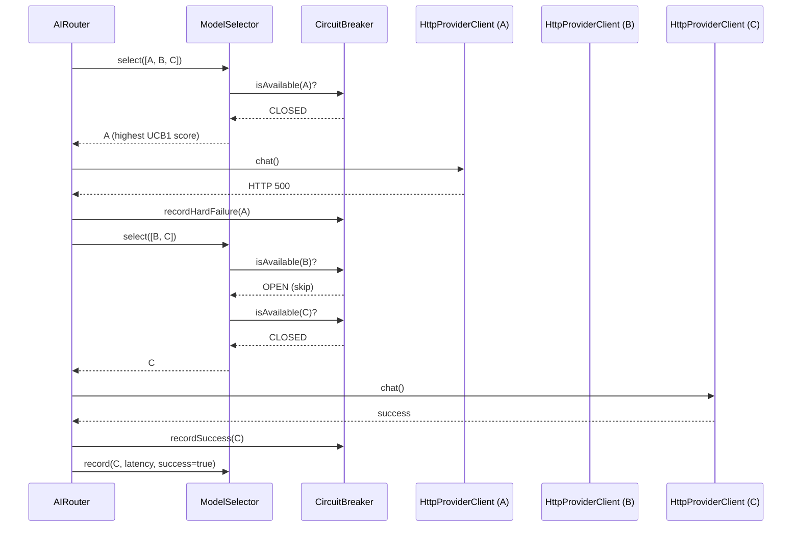
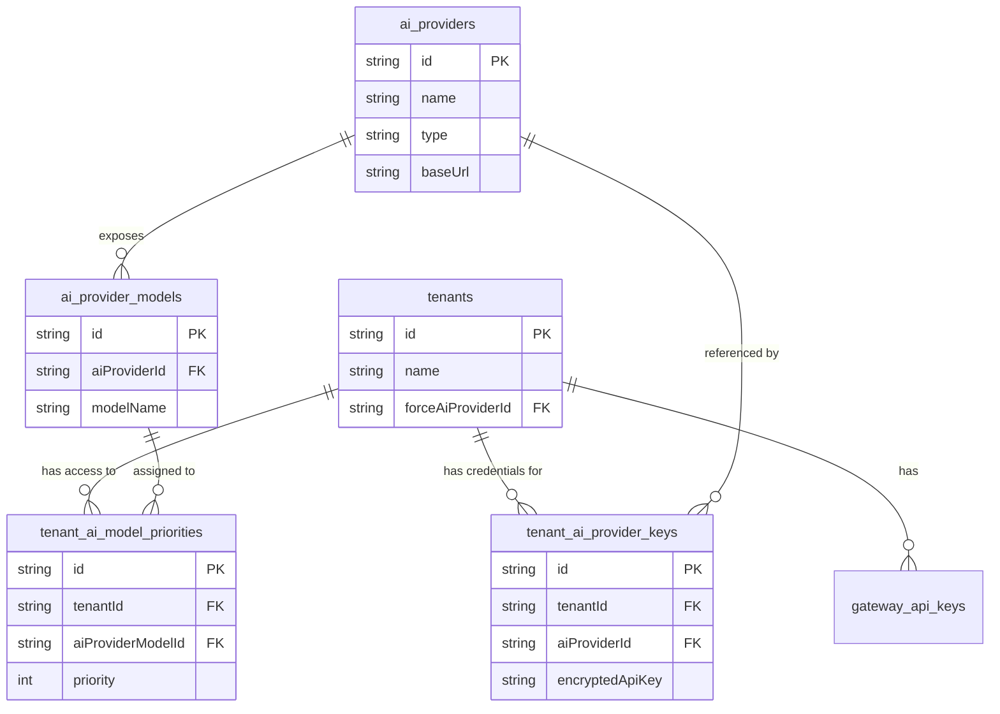
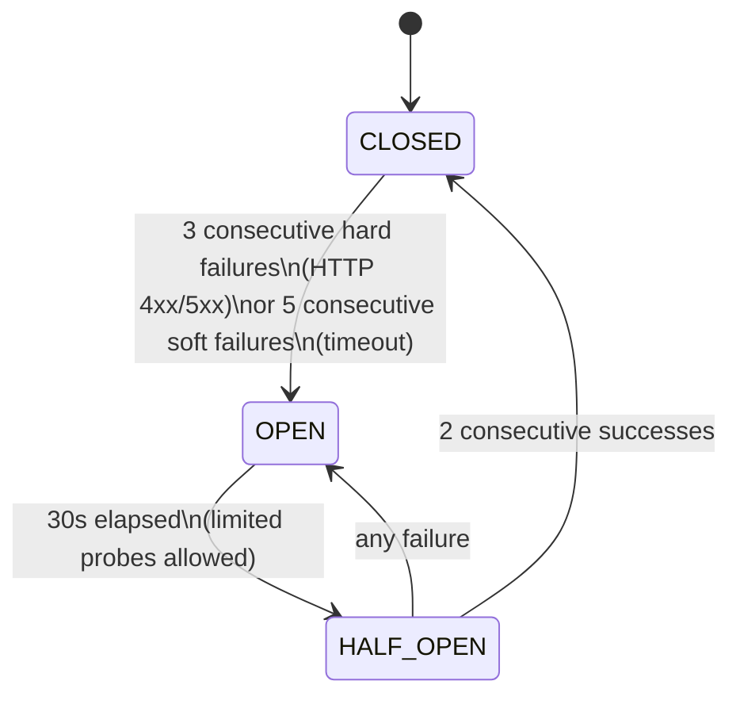

# Multiflow AI Gateway

A self-hosted, multi-tenant AI Gateway written in TypeScript/Bun. It sits between your applications and multiple LLM providers, exposing an OpenAI-compatible API with intelligent routing, resilience, and per-tenant isolation.

---

## Features

- **OpenAI-compatible API** - drop-in replacement for `POST /v1/chat/completions`
- **SSE streaming** - when `stream: true`, the gateway acts as a pure proxy: it forwards the raw SSE stream from the upstream provider to the client without buffering or parsing. The client receives OpenAI-format chunks and is responsible for reassembling them.
- **Tool calling pass-through** - `tools`, `tool_choice`, and all sampling parameters are forwarded transparently to the upstream provider. With `stream: false` the gateway returns the full `tool_calls` response; with `stream: true` the SSE chunks (including `delta.tool_calls`) are proxied raw to the client. In both cases the client (or agent) is responsible for executing tool calls and sending results back as `role: "tool"` messages in the next turn.
- **Agent-compatible** - works with OpenCode, Cursor, and any OpenAI SDK-based client without configuration changes
- **Multi-tenancy** - each tenant has isolated API keys and provider configurations
- **Intelligent model selection** - UCB1-Tuned (default), Thompson Sampling, or SW-UCB1-Tuned, configurable via `SELECTOR_TYPE`
- **Circuit breaker** - automatically skips failing providers and recovers gracefully
- **Multi-model fallback** - up to 10 attempts across different models per request
- **Encrypted secrets** - provider API keys stored at rest with AES-256-GCM
- **Audit logging** - per-request trail stored in SQLite, queryable via Admin API with date and tenant filters
- **Rate limiting** - configurable daily request cap per tenant, enforced via sliding window
- **Admin API** - full CRUD management of tenants, providers, models, credentials, and gateway API keys via REST, protected by master key
- **Observability endpoints** - live snapshots of routing metrics and circuit breaker states via Admin API
- **Auto-generated Swagger UI** - available at `/docs`
- **Modular Architecture** - clean Folder-by-Feature structure for high maintainability

---

## Requirements

- [Bun](https://bun.sh) 1.0+

SQLite is bundled in Bun. Drizzle ORM and Elysia are the only significant runtime dependencies. Migrations are generated and applied automatically on every startup via Drizzle.

---

## Setup

### 1. Install dependencies

```bash
bun install
```

### 2. Configure environment

Copy the example file and fill in the required values:

```bash
cp .env.example .env
```

| Variable | Required | Default | Description |
|---|---|---|---|
| `MASTER_KEY` | yes | - | Protects `/admin/*` endpoints |
| `ENCRYPTION_KEY` | yes | - | AES-256 key for provider API keys (64 hex chars) |
| `PORT` | no | `13000` | HTTP server port |
| `DB_PATH` | no | `./data/gateway.db` | SQLite database path |
| `AUDIT_RETENTION_DAYS` | no | `90` | How many days to retain audit records in the database |
| `SELECTOR_TYPE` | no | `ucb1-tuned` | Model selector algorithm: `ucb1-tuned`, `thompson`, `sw-ucb1-tuned` |
| `LOG_LEVEL` | no | `info` | Log level: `trace`, `debug`, `info`, `warn`, `error` |
| `PROVIDER_STREAM_FIRST_TOKEN_TIMEOUT_MS` | no | `300000` | SSE: max wait for the first chunk from the provider (ms) |
| `PROVIDER_STREAM_WATCHDOG_MS` | no | `120000` | SSE: max total streaming duration per request (ms) |
| `PROVIDER_REQUEST_TIMEOUT_MS` | no | `600000` | Non-streaming: max wait for the complete JSON response from the provider (ms) |
| `SEED_FILE` | no | `./seed.yaml` | Path to the declarative seed file applied at startup. Both `.yaml` and `.yml` extensions are accepted. |
| `METRICS_WARM_UP_WINDOW_MS` | no | `3600000` | How far back (in ms) to look in the audit log to warm up routing metrics on startup. Default is 1 hour. Set to `0` to always start cold. |

Generate the required secret values:

```bash
# MASTER_KEY
openssl rand -base64 32

# ENCRYPTION_KEY (32 bytes as hex)
openssl rand -hex 32
```

### 3. Populate data

Choose one of the two methods below. They are equivalent - use whichever fits your workflow.

#### 3A. Seed file (recommended)

Place a `seed.yaml` or `seed.yml` file in the project root (or set `SEED_FILE` to a custom path). The gateway reads it at startup and idempotently upserts all declared entities. Both `.yaml` and `.yml` extensions are supported: if the configured path is not found, the gateway automatically tries the alternative extension.

```yaml
providers:
  - name: Groq
    type: groq
    baseUrl: https://api.groq.com/openai/v1
    models:
      - llama3-70b-8192
      - llama3-8b-8192
  - name: Ollama
    type: ollama
    baseUrl: http://localhost:11434/v1
    models:
      - qwen3:6b

tenants:
  - name: Acme
    providers:
      - name: Groq
        apiKeyEnv: GROQ_API_KEY
        models:
          - name: llama3-70b-8192
            priority: 0
          - name: llama3-8b-8192
            priority: 1
      - name: Ollama
        models:
          - name: qwen3:6b
            priority: 2
```

**Idempotency:** running the same seed file twice produces no duplicates. Provider credentials are always overwritten, enabling API key rotation on restart. If `apiKeyEnv` is set but the environment variable is not defined, that provider entry for the tenant is skipped entirely. Omitting `apiKeyEnv` stores a null credential (for no-auth providers like Ollama).

**Docker volume mount example:**

```yaml
volumes:
  - ./seed.yml:/app/seed.yml:ro
```

A new tenant's gateway API key is printed to the logs on first creation. It is not stored in plaintext and cannot be retrieved afterwards.

#### 3B. Manual setup via REST API

Use this after the server is running if you prefer to configure tenants and providers dynamically via the Admin API.

```bash
BASE=http://localhost:13000
MASTER=your-master-key

# 1. Create a global provider (once per provider, shared across tenants)
PROVIDER_ID=$(curl -sf -X POST $BASE/admin/providers \
  -H "x-master-key: $MASTER" -H "Content-Type: application/json" \
  -d '{"name":"Groq","type":"groq","baseUrl":"https://api.groq.com/openai/v1"}' \
  | jq -r '.id')

# 2. Add a model to that provider (once per model)
MODEL_ID=$(curl -sf -X POST $BASE/admin/providers/$PROVIDER_ID/models \
  -H "x-master-key: $MASTER" -H "Content-Type: application/json" \
  -d '{"modelName":"llama3-70b-8192"}' \
  | jq -r '.id')

# 3. Create the tenant - save the returned apiKey, it is shown only once
RESULT=$(curl -sf -X POST $BASE/admin/tenants \
  -H "x-master-key: $MASTER" -H "Content-Type: application/json" \
  -d '{"name":"Acme"}')
TENANT_ID=$(echo $RESULT | jq -r '.tenantId')
TENANT_KEY=$(echo $RESULT | jq -r '.apiKey')

# 4. Assign the provider credential to the tenant
curl -sf -X POST $BASE/admin/tenants/$TENANT_ID/credentials \
  -H "x-master-key: $MASTER" -H "Content-Type: application/json" \
  -d "{\"aiProviderId\":\"$PROVIDER_ID\",\"apiKey\":\"sk-groq-secret\"}"

# 5. Assign the model to the tenant with a priority (0 = first choice)
curl -sf -X POST $BASE/admin/tenants/$TENANT_ID/models \
  -H "x-master-key: $MASTER" -H "Content-Type: application/json" \
  -d "{\"aiProviderModelId\":\"$MODEL_ID\",\"priority\":0}"

# 6. The tenant can now call the gateway
curl -X POST $BASE/v1/chat/completions \
  -H "Authorization: Bearer $TENANT_KEY" -H "Content-Type: application/json" \
  -d '{"messages":[{"role":"user","content":"Hello!"}]}'
```

### 4. Start the server

```bash
# Development
bun run dev    # hot reload
bun run check  # typecheck + tests

# Production
bun run start
```

The database is created automatically on first start. The server listens on `http://localhost:13000` (or the configured `PORT`).

### 4b. Run with Docker (alternative)

**Local / development:**

Clone the repo, create a `.env` file (see step 2 above), then:

```bash
# Build and start (foreground)
docker compose up --build

# Build and start (background)
docker compose up --build -d

# Stop
docker compose down
```

**On a remote server:**

Clone the repo on the server, create the `.env` file with production secrets, then run the same commands above. The `docker-compose.yml` uses `build: .` so the source must be present to build the image.

```bash
git clone https://github.com/your-org/multiflow-ai-gateway.git
cd multiflow-ai-gateway
cp .env.example .env   # then fill in MASTER_KEY and ENCRYPTION_KEY
docker compose up --build -d
```

**How the image is built:**

The Dockerfile uses a 2-stage build:

1. **builder** - installs all dependencies, pre-generates Drizzle SQL migrations, and compiles the app into a single self-contained binary
2. **runner** - `gcr.io/distroless/cc-debian12` (pinned SHA), copies only the binary and the `drizzle/` migrations - no `node_modules`, no source files

**Persistence:**

SQLite is stored outside the container via a mounted volume:

| Volume | Container path | Description |
|---|---|---|
| `./data` | `/app/data` | SQLite database file (includes audit records) |

The directory is created automatically on first start. Do not delete `./data` unless you want to wipe the database.

---

## Architecture

### Request lifecycle

```
Request
  |
  v
Elysia HTTP server (index.ts)
  |
  v
Auth Module (src/auth/auth.middleware.ts)
  |
  v
Chat Module (src/chat/chat.routes.ts)
  |
  v
Tenant Resolver (src/tenant/tenant-model-pool.resolver.ts)
  |
  v
AIRouter (src/engine/routing/ai-router.ts)
  |-- ModelSelector          (pluggable strategy: UCB1-Tuned, Thompson Sampling, SW-UCB1-Tuned)
  |-- CircuitBreaker        (skips models in OPEN state)
  |-- HttpProviderClient    (low-level HTTP to OpenAI-compatible endpoint)
  |-- MetricsStore          (updates latency/success EMA after each chat)
  |-- AuditStore (src/audit/audit.store.ts)
```

### Routing and retry loop

On each request `AIRouter` attempts models one by one (up to 10) until one succeeds or all are exhausted. The circuit breaker and selector collaborate to skip unhealthy models and prefer the fastest/most reliable one.



### Database

SQLite via Drizzle ORM. Schema defined in `src/db/schema.ts`. Migrations in `drizzle/` and applied automatically at boot.

| Table | Purpose |
|---|---|
| `tenants` | Tenant registry |
| `gateway_api_keys` | SHA-256 hashes of issued gateway API keys |
| `ai_providers` | Global provider registry (Groq, Ollama, OpenRouter, ...) |
| `ai_provider_models` | Models available per provider |
| `tenant_ai_provider_keys` | Per-tenant API key for each provider (AES-256-GCM encrypted) |
| `tenant_ai_model_priorities` | Which models a tenant can use, with priority order |
| `request_log` | Per-request audit trail (used for rate limiting and export via Admin API) |



---

## Tenant and Provider Configuration

### How the data model works

Providers and their models are **global resources** managed by the admin. Tenants never share configurations directly: what makes a provider available to a tenant is the combination of:

1. A **credential** (`POST /admin/tenants/:id/credentials`) - the tenant's own API key for that provider, stored encrypted.
2. A **model config** (`POST /admin/tenants/:id/models`) - which specific model(s) the tenant is allowed to route to, with an optional priority.

The gateway builds the routing candidate list per request by joining these tables for the calling tenant only. Two tenants that both use Groq have separate credentials and separate model lists; neither can see or affect the other.

```
Global layer (admin-managed)          Per-tenant layer
--------------------------------      ------------------------------------------
ai_providers                          tenant_ai_provider_keys    (tenant's API key per provider)
  |-- ai_provider_models         <--  tenant_ai_model_priorities (which models + priority order)
```

---

## Model Selection Algorithms

The gateway uses a multi-armed bandit strategy to pick the best model for each request. The algorithm is configured globally via the `SELECTOR_TYPE` environment variable.

Each algorithm evaluates models that are not blocked by the circuit breaker. Models with zero observations are always tried first (warmup phase), except Thompson Sampling which handles exploration naturally via its distribution.

| Algorithm | `SELECTOR_TYPE` | Default | Signals used |
|---|---|---|---|
| UCB1-Tuned | `ucb1-tuned` | **YES** | success rate + latency (full history) |
| SW-UCB1-Tuned | `sw-ucb1-tuned` | no | success rate + latency (last W calls) |
| Thompson Sampling | `thompson` | no | success/failure counts only |

### Circuit breaker state machine

The circuit breaker runs per model and is shared across all requests (in-memory singleton). It prevents wasting time on known-down providers.



### UCB1-Tuned (default)

Balances success rate and latency 50/50 into a reward score, then adds an exploration bonus that shrinks as observations accumulate. Uses the observed variance of rewards to avoid over-exploring stable models.

**Use when**: traffic is low-to-medium (tens to low hundreds of calls per day per tenant), or when provider behavior is stable. The best general-purpose choice.

### SW-UCB1-Tuned

Same algorithm as UCB1-Tuned but metrics are computed from the last W observations (default: 100) instead of full history. Reacts to provider degradations and recoveries within W calls.

**Use when**: traffic is high enough to fill the window (hundreds or more calls per day per tenant) and fast reaction to provider quality changes matters more than stability. With very low traffic the window stays sparse and estimates become noisy - UCB1-Tuned is safer in that case.

### Thompson Sampling

Models each provider as a Beta distribution over success/failure counts and draws a random sample at each selection. Does not consider latency. Statistically efficient for pure success/failure optimization.

**Use when**: latency differences between providers are negligible and you only care about availability/error rates.

---

## Operational Notes

### Routing state is in-memory only

The `AIRouterFactory` - which owns the `MetricsStore`, `CircuitBreaker`, and `ModelSelector` instances - is created once at startup and shared between the chat plugin and the admin plugin. A new `AIRouter` is built per request via `factory.create()`, but it shares these stateful components across all requests. This means routing metrics and circuit breaker statuses persist across requests but are **in-memory only**.

On every restart, the `MetricsStore` is automatically warmed up from the audit log: all `request_log` records within the last hour (configurable via `METRICS_WARM_UP_WINDOW_MS`) are replayed in chronological order so the selector starts with meaningful latency and success-rate estimates rather than a blank slate. If no records exist within the window (e.g. after a long downtime), the store starts cold and UCB1 explores all models uniformly until it converges. Circuit breaker state is always reset on restart.

### Back up ENCRYPTION_KEY separately from the database

If you lose the `ENCRYPTION_KEY` environment variable, every provider API key stored in the database becomes permanently unreadable. The gateway cannot decrypt them and all tenant credentials must be re-entered from scratch. Store `ENCRYPTION_KEY` in a secrets manager or a location that is independent of the database file.

---

## API Reference

Interactive docs available at `http://localhost:13000/docs` once the server is running.

### Health

```
GET /health
```

Returns `{ "status": "ok", "timestamp": "..." }`.

---

### Documentation

```
GET /docs          # Swagger UI
GET /openapi.json  # OpenAPI 3.0 spec
```

---

### Chat completions

```
POST /v1/chat/completions
Authorization: Bearer <tenant-api-key>
Content-Type: application/json
```

OpenAI-compatible request body:

```json
{
  "model": "optional-model-filter",
  "messages": [
    { "role": "user", "content": "Hello!" }
  ],
  "system": "Optional system prompt override",
  "stream": false
}
```

**Sampling parameters** (all forwarded verbatim to the upstream provider):

| Parameter | Type | Description |
|---|---|---|
| `temperature` | number | Sampling temperature |
| `top_p` | number | Nucleus sampling |
| `max_tokens` | integer | Max tokens in the response |
| `max_completion_tokens` | integer | Alternative to `max_tokens` |
| `presence_penalty` | number | Penalize repeated topics |
| `frequency_penalty` | number | Penalize repeated tokens |
| `seed` | integer | Reproducibility seed |
| `stop` | string or string[] | Stop sequences |
| `response_format` | object | e.g. `{"type":"json_object"}` |
| `stream_options` | object | SSE stream options |
| `user` | string | End-user identifier |
| `parallel_tool_calls` | boolean | Allow parallel tool calls |

**Tool calling**

Pass `tools` and `tool_choice` in the body. They are forwarded as-is to the upstream provider. The client (agent) is responsible for executing tool calls and sending results back as `role: "tool"` messages.

```json
{
  "messages": [{ "role": "user", "content": "What is the weather in Rome?" }],
  "tools": [{
    "type": "function",
    "function": {
      "name": "get_weather",
      "description": "Get current weather for a city",
      "parameters": {
        "type": "object",
        "properties": { "city": { "type": "string" } },
        "required": ["city"]
      }
    }
  }],
  "tool_choice": "auto"
}
```

When the model wants to call a tool, the gateway returns:

```json
{
  "choices": [{
    "finish_reason": "tool_calls",
    "message": {
      "role": "assistant",
      "content": null,
      "tool_calls": [{
        "id": "call_abc",
        "type": "function",
        "function": { "name": "get_weather", "arguments": "{\"city\":\"Rome\"}" }
      }]
    }
  }]
}
```

**Using the gateway with agents (OpenCode, Cursor, any OpenAI-compatible client)**

The gateway exposes an OpenAI-compatible API. Any agent or SDK that supports a custom OpenAI base URL can point to it directly:

```python
from openai import OpenAI
client = OpenAI(base_url="http://localhost:13000/v1", api_key="gw_your_tenant_key")
```

```bash
# OpenCode / Cursor: set the OpenAI base URL in the tool settings
OPENAI_BASE_URL=http://localhost:13000/v1
OPENAI_API_KEY=gw_your_tenant_key
```

Note: agents that use the Anthropic API format natively (e.g. Claude Code via `ANTHROPIC_BASE_URL`) are not directly compatible because the gateway speaks OpenAI format only (`/v1/chat/completions`), not the Anthropic Messages API (`/v1/messages`).

The `model` field is optional and supports two formats. If your client requires a non-empty model name, use the special value `"multiflow-ai-gateway-auto-model"`: the gateway treats it as if `model` were omitted and routes freely across all tenant models.

- **`"model"`** - matches all providers that have a model with that name. If multiple providers expose the same model name, all are routing candidates and the selector picks the best one. This is intentional: it enables transparent multi-provider fallback.
- **`"provider/model"`** - filters to a specific provider by name (case-insensitive) before applying model matching. Use this when you need to target a particular backend explicitly.

```jsonc
// routes to any provider with model "llama-3-70b"
{ "model": "llama-3-70b", ... }

// routes only to the provider named "Groq" with model "llama-3-70b"
{ "model": "groq/llama-3-70b", ... }
```

When omitted, all enabled providers for the tenant are candidates.

#### Routing to a subset of models (gateway extension)

The `models` field (array of strings) is a gateway-specific extension that restricts routing to an explicit subset of the tenant's configured models. It takes precedence over `model` and cannot be used together with it.

Each entry supports the same `"model"` or `"provider/model"` syntax as the `model` field. The routing engine uses the union of all matching configs as the candidate pool, then applies the normal selector and circuit breaker.

```jsonc
// routes only to these three models across different providers
{ "models": ["groq/llama-3-70b", "openai/gpt-4o-mini", "gemma-2-9b"], ... }
```

Use this when a single tenant needs different model pools for different workloads (e.g. fast cheap models for one use case, powerful models for another) without creating multiple tenants.

Returns an OpenAI-compatible response object (or SSE stream when `stream: true`).

**Custom Headers**

The gateway injects headers into the response to help you identify which provider fulfilled the request:
- `X-Model`: The actual model name used.
- `X-AI-Provider`: The name of the provider (e.g., "Groq").
- `X-AI-Provider-URL`: The base URL of the provider.

---

### Admin API

All admin endpoints require the `X-Master-Key` header.

**Tenants**
- `GET /admin/tenants` - List all tenants
- `POST /admin/tenants` - Create tenant
- `GET /admin/tenants/:id` - Get details (includes credentials/models)
- `PATCH /admin/tenants/:id` - Update settings (`forceAiProviderId`, `rateLimitDailyRequests`; pass null to remove a limit)
- `DELETE /admin/tenants/:id` - Hard delete tenant (cascades to keys and model assignments)

**Audit**
- `GET /admin/audit` - Query audit log (filters: `tenantId`, `from`, `to` as ISO dates, `limit`, `offset`)

**Global Providers**
- `GET /admin/providers` - List global providers
- `POST /admin/providers` - Create provider
- `PATCH /admin/providers/:providerId` - Update provider (`type`, `baseUrl`)
- `DELETE /admin/providers/:providerId` - Hard delete provider (cascades)
- `GET /admin/providers/:providerId/models` - List models for a provider
- `POST /admin/providers/:providerId/models` - Add model to provider
- `PATCH /admin/providers/:providerId/models/:modelId` - Update model (toggle `enabled`)
- `DELETE /admin/providers/:providerId/models/:modelId` - Hard delete model (cascades)

**Tenant assignments**
- `POST /admin/tenants/:id/credentials` - Assign provider API key to tenant
- `PATCH /admin/tenants/:id/credentials/:credentialId` - Update credential (toggle `enabled`)
- `DELETE /admin/tenants/:id/credentials/:credentialId` - Hard delete credential
- `POST /admin/tenants/:id/models` - Assign model priority to tenant
- `PATCH /admin/tenants/:id/models/:entryId` - Update model priority entry (`priority`, `enabled`)
- `DELETE /admin/tenants/:id/models/:entryId` - Hard delete model priority entry

**Gateway API keys**
- `GET /admin/tenants/:id/api-keys` - List gateway API keys for a tenant
- `POST /admin/tenants/:id/api-keys` - Issue a new gateway API key for a tenant
- `DELETE /admin/tenants/:id/api-keys/:keyId` - Revoke a gateway API key

**Observability**
- `GET /admin/metrics` - Live snapshot of routing metrics (latency, success rates per model)
- `GET /admin/circuit-breakers` - Live snapshot of circuit breaker states per model

---

## Error Responses

| Status | When |
|---|---|
| `400` | `messages` is missing or empty; requested `model` not available for this tenant |
| `401` | Missing, malformed, or invalid `Authorization: Bearer` header |
| `429` | Tenant has exceeded its daily rate limit (`rateLimitDailyRequests`) |
| `403` | Wrong or missing `X-Master-Key` on admin endpoints |
| `404` | Tenant or resource not found |
| `422` | Tenant has no provider models configured |
| `503` | AI Service unavailable (all providers down or circuit breaker open) |
| `500` | Internal error |

### 503 Service Unavailable Body

When all AI providers are unavailable, the gateway returns:

```json
{
  "error": {
    "message": "AI service unavailable. All providers are currently exhausted or down.",
    "code": "ai_unavailable",
    "type": "service_unavailable"
  }
}
```

---

## Project Structure

The project follows a **Modular Architecture (Folder-by-Feature)**. Each feature directory contains its own routes, services, schemas, and tests.

```
src/
  admin/                    # Admin API routes
  audit/                    # Audit store (SQLite-backed request log, rate limit check)
  auth/                     # Authentication (Tenant & Admin)
  bootstrap/                # Declarative seed file bootstrap (seed.yaml)
  chat/                     # Chat Completions feature (core)
  config/                   # App configuration
  db/                       # Database connection and schema
  engine/                   # Shared AI Engine core
    |-- client/             # AI Provider clients and response parsers
    |-- observability/      # Latency and success rate metrics
    |-- resilience/         # Circuit breaker implementation
    |-- routing/            # Multi-model routing logic and factory
    |-- selection/          # Model selection: types and algorithm implementations
    |   |-- algorithms/     # UCB1-Tuned, SW-UCB1-Tuned, Thompson Sampling
  provider/                 # Global provider registry
  tenant/                   # Tenant management and resolution
  housekeeping/             # Periodic cleanup of expired audit records
  crypto/                   # Envelope encryption service (AES-256-GCM)
  utils/                    # Shared utilities (http, logger)
  index.ts                  # Entry point
```

File naming convention: `[feature].[type].ts` (e.g., `chat.routes.ts`, `tenant.store.ts`).

---

## Roadmap

| # | Feature | Priority | Area |
|---|---------|----------|------|
| 1 | Prometheus metrics endpoint | Critical | Observability |
| 2 | ~~Rate limiting / sub-users per tenant~~ - per-tenant daily rate limit shipped | done | Multi-tenancy |
| - | ~~Full CRUD Admin API~~ - delete/update for tenants, providers, models, credentials, model priorities, gateway API keys shipped | done | Admin |
| - | ~~Observability endpoints~~ - `/admin/metrics` and `/admin/circuit-breakers` snapshots shipped | done | Observability |
| 3 | Proactive health checks | High | Routing |
| 4 | Exact-match prompt caching | High | Performance |
| 5 | Additional provider adapters (Groq, Gemini, Claude native) | Medium | Providers |
| 6 | BYOK per-request | Medium | Auth |
| 7 | PostgreSQL support | Low | Infrastructure |
| 8 | Thinking control | Low | Routing |

### Thinking control (item 8)

Thinking-capable models (e.g. Qwen3, DeepSeek-R1 on Ollama) produce verbose internal reasoning that gets included in the conversation history by the client, inflating subsequent payloads. There is no universal OpenAI-compatible standard for controlling thinking: Ollama uses `think: true`, OpenAI o1/o3 uses `reasoning_effort`, Anthropic has its own format.

The approach needs to be designed. Open questions:
- Per-request field (client decides) vs per-model configuration (admin decides at setup time)?
- How to normalize across providers with different field names?
- Should the gateway strip thinking content from incoming messages before forwarding to providers that do not support it?
