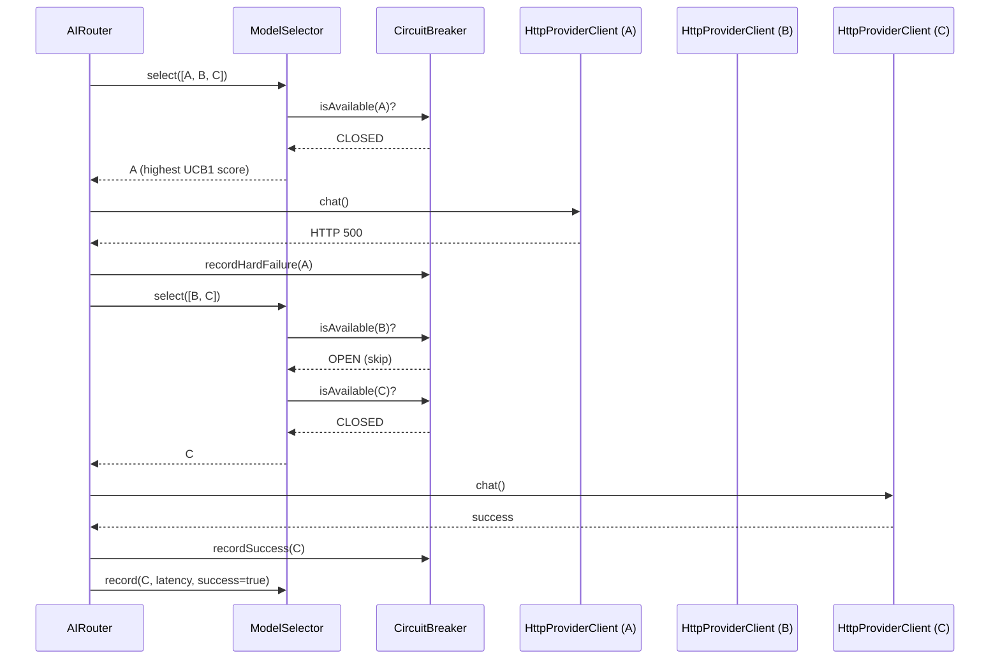
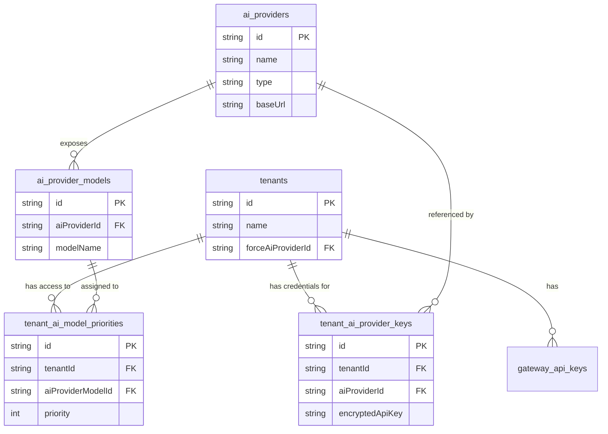
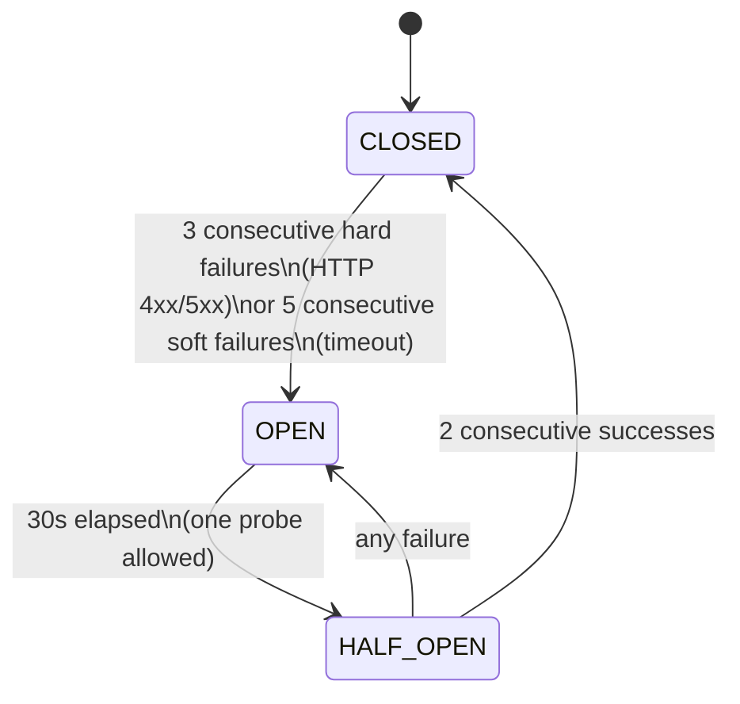

# Multiflow AI Gateway

A self-hosted, multi-tenant AI Gateway written in TypeScript/Bun. It sits between your applications and multiple LLM providers, exposing an OpenAI-compatible API with intelligent routing, resilience, and per-tenant isolation.

---

## Features

- **OpenAI-compatible API** - drop-in replacement for `POST /v1/chat/completions` with SSE streaming support
- **Multi-tenancy** - each tenant has isolated API keys and provider configurations
- **Intelligent model selection** - UCB1-Tuned (default), Thompson Sampling, or SW-UCB1-Tuned, configurable via `SELECTOR_TYPE`
- **Circuit breaker** - automatically skips failing providers and recovers gracefully
- **Multi-model fallback** - up to 10 attempts across different models per request
- **Tool calling (Engine)** - up to 10 rounds of internal tool execution (not yet exposed via public API)
- **Encrypted secrets** - provider API keys stored at rest with AES-256-GCM
- **Audit logging** - append-only JSON lines trail per request
- **Admin API** - manage tenants and providers via REST, protected by master key
- **Auto-generated Swagger UI** - available at `/docs`
- **Modular Architecture** - clean Folder-by-Feature structure for high maintainability

---

## Requirements

- [Bun](https://bun.sh) 1.0+

SQLite is bundled in Bun. Drizzle ORM and Elysia are the only significant runtime dependencies. Migrations are generated and applied automatically on every startup via Drizzle.

---

## Setup

### 1. Install dependencies

```bash
bun install
```

### 2. Configure environment

Copy the example file and fill in the required values:

```bash
cp .env.example .env
```

| Variable | Required | Default | Description |
|---|---|---|---|
| `MASTER_KEY` | yes | - | Protects `/admin/*` endpoints |
| `ENCRYPTION_KEY` | yes | - | AES-256 key for provider API keys (64 hex chars) |
| `PORT` | no | `3000` | HTTP server port |
| `DB_PATH` | no | `./data/gateway.db` | SQLite database path |
| `AUDIT_LOG_PATH` | no | `./logs/audit.jsonl` | Audit log file path |
| `SELECTOR_TYPE` | no | `ucb1-tuned` | Model selector algorithm: `ucb1-tuned`, `thompson`, `sw-ucb1-tuned` |
| `LOG_LEVEL` | no | `info` | Log level: `trace`, `debug`, `info`, `warn`, `error` |
| `FIRST_TOKEN_TIMEOUT_MS` | no | `30000` | Max wait for first token from a provider (ms) |
| `STREAM_WATCHDOG_MS` | no | `120000` | Max total streaming duration per request (ms) |
| `SEED_FILE` | no | `./seed.yaml` | Path to the declarative seed file applied at startup |

Generate the required secret values:

```bash
# MASTER_KEY
openssl rand -base64 32

# ENCRYPTION_KEY (32 bytes as hex)
openssl rand -hex 32
```

### 3. Seed file (optional)

Place a `seed.yaml` file in the project root (or set `SEED_FILE` to a custom path). The gateway reads it at startup and idempotently upserts all declared entities.

```yaml
providers:
  - name: Groq
    type: groq
    baseUrl: https://api.groq.com/openai/v1
    models:
      - llama3-70b-8192
      - llama3-8b-8192
  - name: Ollama
    type: ollama
    baseUrl: http://localhost:11434/v1
    models:
      - qwen3:6b

tenants:
  - name: Acme
    providers:
      - name: Groq
        apiKeyEnv: GROQ_API_KEY
        models:
          - name: llama3-70b-8192
            priority: 0
          - name: llama3-8b-8192
            priority: 1
      - name: Ollama
        models:
          - name: qwen3:6b
            priority: 2
```

**Idempotency:** running the same seed file twice produces no duplicates. Provider credentials are always overwritten, enabling API key rotation on restart. If `apiKeyEnv` is set but the environment variable is not defined, that provider entry for the tenant is skipped entirely. Omitting `apiKeyEnv` stores a null credential (for no-auth providers like Ollama).

**Docker volume mount example:**

```yaml
volumes:
  - ./seed.yaml:/app/seed.yaml:ro
```

A new tenant's gateway API key is printed to the logs on first creation. It is not stored in plaintext and cannot be retrieved afterwards.

### 4. Start the server

```bash
# Development
bun run dev    # hot reload
bun run check  # typecheck + tests

# Production
bun run start
```

The database is created automatically on first start. The server listens on `http://localhost:3000` (or the configured `PORT`).

### 3b. Run with Docker (alternative)

**Local / development:**

Clone the repo, create a `.env` file (see step 2 above), then:

```bash
# Build and start (foreground)
docker compose up --build

# Build and start (background)
docker compose up --build -d

# Stop
docker compose down
```

**On a remote server:**

Clone the repo on the server, create the `.env` file with production secrets, then run the same commands above. The `docker-compose.yml` uses `build: .` so the source must be present to build the image.

```bash
git clone https://github.com/your-org/multiflow-ai-gateway.git
cd multiflow-ai-gateway
cp .env.example .env   # then fill in MASTER_KEY and ENCRYPTION_KEY
docker compose up --build -d
```

**How the image is built:**

The Dockerfile uses a 3-stage build (~252MB final image):

1. **deps** - installs only production dependencies (`--production`)
2. **builder** - installs all dependencies and pre-generates Drizzle SQL migrations
3. **runner** - `oven/bun:1-slim` base, copies prod `node_modules`, `src/`, and pre-generated `drizzle/` migrations

**Persistence:**

SQLite and audit logs are stored outside the container via mounted volumes:

| Volume | Container path | Description |
|---|---|---|
| `./data` | `/app/data` | SQLite database file |
| `./logs` | `/app/logs` | Audit log (`audit.jsonl`) |

Both directories are created automatically on first start. Do not delete `./data` unless you want to wipe the database.

---

## Architecture

### Request lifecycle

```
Request
  |
  v
Elysia HTTP server (index.ts)
  |
  v
Auth Module (src/auth/auth.middleware.ts)
  |
  v
Chat Module (src/chat/chat.routes.ts)
  |
  v
Tenant Resolver (src/tenant/tenant-model-config.resolver.ts)
  |
  v
AIRouter (src/engine/routing/ai-router.ts)
  |-- ModelSelector          (pluggable strategy: UCB1-Tuned, Thompson Sampling, SW-UCB1-Tuned)
  |-- CircuitBreaker        (skips models in OPEN state)
  |-- HttpProviderClient    (low-level HTTP to OpenAI-compatible endpoint)
  |   |-- ToolCallOrchestrator (handles multi-turn tool execution loop)
  |-- MetricsStore          (updates latency/success EMA after each chat)
  |-- Audit Log (src/audit/audit.log.ts)
```

### Routing and retry loop

On each request `AIRouter` attempts models one by one (up to 10) until one succeeds or all are exhausted. The circuit breaker and selector collaborate to skip unhealthy models and prefer the fastest/most reliable one.



### Database

SQLite via Drizzle ORM. Schema defined in `src/db/schema.ts`. Migrations in `drizzle/` and applied automatically at boot.

| Table | Purpose |
|---|---|
| `tenants` | Tenant registry |
| `gateway_api_keys` | SHA-256 hashes of issued gateway API keys |
| `ai_providers` | Global provider registry (Groq, Ollama, OpenRouter, ...) |
| `ai_provider_models` | Models available per provider |
| `tenant_ai_provider_keys` | Per-tenant API key for each provider (AES-256-GCM encrypted) |
| `tenant_ai_model_priorities` | Which models a tenant can use, with priority order |



---

## Quick Start: Onboard a New Client

The full flow to add a tenant and make it ready to call `/v1/chat/completions`:

```bash
BASE=http://localhost:3000
MASTER=your-master-key

# 1. Create a global provider (once per provider, shared across tenants)
PROVIDER_ID=$(curl -sf -X POST $BASE/admin/providers \
  -H "x-master-key: $MASTER" -H "Content-Type: application/json" \
  -d '{"name":"Groq","type":"groq","baseUrl":"https://api.groq.com/openai/v1"}' \
  | jq -r '.id')

# 2. Add a model to that provider (once per model)
MODEL_ID=$(curl -sf -X POST $BASE/admin/providers/$PROVIDER_ID/models \
  -H "x-master-key: $MASTER" -H "Content-Type: application/json" \
  -d '{"modelName":"llama3-70b-8192"}' \
  | jq -r '.id')

# 3. Create the tenant -- save the returned apiKey, it is shown only once
RESULT=$(curl -sf -X POST $BASE/admin/tenants \
  -H "x-master-key: $MASTER" -H "Content-Type: application/json" \
  -d '{"name":"ClienteA"}')
TENANT_ID=$(echo $RESULT | jq -r '.tenantId')
TENANT_KEY=$(echo $RESULT | jq -r '.apiKey')

# 4. Assign the provider credential to the tenant
curl -sf -X POST $BASE/admin/tenants/$TENANT_ID/credentials \
  -H "x-master-key: $MASTER" -H "Content-Type: application/json" \
  -d "{\"aiProviderId\":\"$PROVIDER_ID\",\"apiKey\":\"sk-groq-secret\"}"

# 5. Assign the model to the tenant with a priority (0 = first choice)
curl -sf -X POST $BASE/admin/tenants/$TENANT_ID/models \
  -H "x-master-key: $MASTER" -H "Content-Type: application/json" \
  -d "{\"aiProviderModelId\":\"$MODEL_ID\",\"priority\":0}"

# 6. The tenant can now call the gateway
curl -X POST $BASE/v1/chat/completions \
  -H "Authorization: Bearer $TENANT_KEY" -H "Content-Type: application/json" \
  -d '{"messages":[{"role":"user","content":"Hello!"}]}'
```

---

## Tenant and Provider Configuration

### How the data model works

Providers and their models are **global resources** managed by the admin. Tenants never share configurations directly: what makes a provider available to a tenant is the combination of:

1. A **credential** (`POST /admin/tenants/:id/credentials`) -- the tenant's own API key for that provider, stored encrypted.
2. A **model config** (`POST /admin/tenants/:id/models`) -- which specific model(s) the tenant is allowed to route to, with an optional priority.

The gateway builds the routing candidate list per request by joining these tables for the calling tenant only. Two tenants that both use Groq have separate credentials and separate model lists; neither can see or affect the other.

```
Global layer (admin-managed)          Per-tenant layer
--------------------------------      ------------------------------------------
ai_providers                          tenant_ai_provider_keys    (tenant's API key per provider)
  |-- ai_provider_models         <--  tenant_ai_model_priorities (which models + priority order)
```

---

## Model Selection Algorithms

The gateway uses a multi-armed bandit strategy to pick the best model for each request. The algorithm is configured globally via the `SELECTOR_TYPE` environment variable.

Each algorithm evaluates models that are not blocked by the circuit breaker. Models with zero observations are always tried first (warmup phase), except Thompson Sampling which handles exploration naturally via its distribution.

| Algorithm | `SELECTOR_TYPE` | Default | Signals used |
|---|---|---|---|
| UCB1-Tuned | `ucb1-tuned` | **YES** | success rate + latency (full history) |
| SW-UCB1-Tuned | `sw-ucb1-tuned` | no | success rate + latency (last W calls) |
| Thompson Sampling | `thompson` | no | success/failure counts only |

### Circuit breaker state machine

The circuit breaker runs per model and is shared across all requests (in-memory singleton). It prevents wasting time on known-down providers.



### UCB1-Tuned (default)

Balances success rate and latency 50/50 into a reward score, then adds an exploration bonus that shrinks as observations accumulate. Uses the observed variance of rewards to avoid over-exploring stable models.

**Use when**: traffic is low-to-medium (tens to low hundreds of calls per day per tenant), or when provider behavior is stable. The best general-purpose choice.

### SW-UCB1-Tuned

Same algorithm as UCB1-Tuned but metrics are computed from the last W observations (default: 100) instead of full history. Reacts to provider degradations and recoveries within W calls.

**Use when**: traffic is high enough to fill the window (hundreds or more calls per day per tenant) and fast reaction to provider quality changes matters more than stability. With very low traffic the window stays sparse and estimates become noisy -- UCB1-Tuned is safer in that case.

### Thompson Sampling

Models each provider as a Beta distribution over success/failure counts and draws a random sample at each selection. Does not consider latency. Statistically efficient for pure success/failure optimization.

**Use when**: latency differences between providers are negligible and you only care about availability/error rates.

---

## Operational Notes

### Routing state is in-memory only

The `AIRouterFactory` -- which owns the `MetricsStore`, `CircuitBreaker`, and `ModelSelector` instances -- is created once when the chat plugin initializes. A new `AIRouter` is built per request via `factory.create()`, but it shares these stateful components across all requests. This means routing metrics and circuit breaker statuses persist across requests but are **in-memory only and reset to zero on every server restart**. After a restart, all models start fresh with no learned preferences or failure counts.

### Back up ENCRYPTION_KEY separately from the database

If you lose the `ENCRYPTION_KEY` environment variable, every provider API key stored in the database becomes permanently unreadable. The gateway cannot decrypt them and all tenant credentials must be re-entered from scratch. Store `ENCRYPTION_KEY` in a secrets manager or a location that is independent of the database file.

---

## API Reference

Interactive docs available at `http://localhost:3000/docs` once the server is running.

### Health

```
GET /health
```

Returns `{ "status": "ok", "timestamp": "..." }`.

---

### Documentation

```
GET /docs          # Swagger UI
GET /openapi.json  # OpenAPI 3.0 spec
```

---

### Chat completions

```
POST /v1/chat/completions
Authorization: Bearer <tenant-api-key>
Content-Type: application/json
```

OpenAI-compatible request body:

```json
{
  "model": "optional-model-filter",
  "messages": [
    { "role": "user", "content": "Hello!" }
  ],
  "system": "Optional system prompt override",
  "stream": false
}
```

The `model` field is optional and supports two formats:

- **`"model"`** -- matches all providers that have a model with that name. If multiple providers expose the same model name, all are routing candidates and the selector picks the best one. This is intentional: it enables transparent multi-provider fallback.
- **`"provider/model"`** -- filters to a specific provider by name (case-insensitive) before applying model matching. Use this when you need to target a particular backend explicitly.

```jsonc
// routes to any provider with model "openai" -- multi-provider pool
{ "model": "openai", ... }

// routes only to the provider named "Pollinations" with model "openai"
{ "model": "pollinations/openai", ... }
```

When omitted, all enabled providers for the tenant are candidates.

Returns an OpenAI-compatible response object (or SSE stream when `stream: true`).

**Custom Headers**

The gateway injects headers into the response to help you identify which provider fulfilled the request:
- `X-Model`: The actual model name used.
- `X-AI-Provider`: The name of the provider (e.g., "Groq").
- `X-AI-Provider-URL`: The base URL of the provider.

---

### Admin API

All admin endpoints require the `X-Master-Key` header.

**Tenants**
- `GET /admin/tenants` - List all tenants
- `POST /admin/tenants` - Create tenant
- `GET /admin/tenants/:id` - Get details (includes credentials/models)
- `PATCH /admin/tenants/:id` - Update settings (e.g. `forceAiProviderId`)

**Global Providers**
- `GET /admin/providers` - List global providers
- `POST /admin/providers` - Create provider
- `GET /admin/providers/:id/models` - List models for a provider
- `POST /admin/providers/:id/models` - Add model to provider

**Tenant assignments**
- `POST /admin/tenants/:id/credentials` - Assign provider API key to tenant
- `POST /admin/tenants/:id/models` - Assign model priority to tenant

---

## Error Responses

| Status | When |
|---|---|
| `400` | `messages` is missing or empty; requested `model` not available for this tenant |
| `401` | Missing, malformed, or invalid `Authorization: Bearer` header |
| `403` | Wrong or missing `X-Master-Key` on admin endpoints |
| `404` | Tenant or resource not found |
| `422` | Tenant has no provider models configured |
| `503` | AI Service unavailable (all providers down or circuit breaker open) |
| `500` | Internal error |

### 503 Service Unavailable Body

When all AI providers are unavailable, the gateway returns:

```json
{
  "error": {
    "message": "AI service unavailable. All providers are currently exhausted or down.",
    "code": "ai_unavailable",
    "type": "service_unavailable"
  }
}
```

---

## Project Structure

The project follows a **Modular Architecture (Folder-by-Feature)**. Each feature directory contains its own routes, services, schemas, and tests.

```
src/
  admin/                    # Admin API routes
  audit/                    # Audit logging and decorator
  auth/                     # Authentication (Tenant & Admin)
  bootstrap/                # Declarative seed file bootstrap (seed.yaml)
  chat/                     # Chat Completions feature (core)
  config/                   # App configuration
  db/                       # Database connection and schema
  engine/                   # Shared AI Engine core
    |-- client/             # AI Provider clients and response parsers
    |-- observability/      # Latency and success rate metrics
    |-- resilience/         # Circuit breaker implementation
    |-- routing/            # Multi-model routing logic and factory
    |-- selection/          # Model selection: types and algorithm implementations
    |   |-- algorithms/     # UCB1-Tuned, SW-UCB1-Tuned, Thompson Sampling
    |-- tools/              # Tool-calling (function calling) orchestration
  provider/                 # Global provider registry
  tenant/                   # Tenant management and resolution
  crypto/                   # Envelope encryption service (AES-256-GCM)
  utils/                    # Shared utilities (http, logger)
  index.ts                  # Entry point
```

File naming convention: `[feature].[type].ts` (e.g., `chat.routes.ts`, `tenant.store.ts`).

---

## Roadmap

- Sub-users per tenant with per-user rate limits
- LightRAG integration for multi-domain RAG
- MCP client support per tenant
- Prometheus metrics endpoint
- Additional provider adapters (Groq, Gemini native, Claude native)
- Web admin UI
- PostgreSQL support for horizontal scaling
